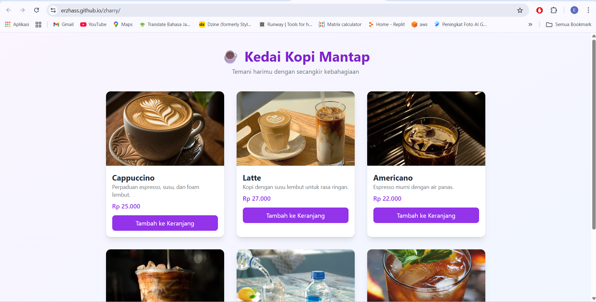

# ☕ Kedai Kopi Mantap – Web Pemesanan Kopi

Web sederhana berbasis HTML, TailwindCSS, dan JavaScript untuk mensimulasikan sistem pemesanan kopi mulai dari memilih menu, mengisi data, hingga halaman konfirmasi. Cocok untuk tugas sekolah, portofolio, atau latihan frontend.

---

## ✨ Fitur Utama

- **Halaman Utama (Landing Page)** berisi informasi dan tombol untuk memulai pemesanan.
- **Form Pemesanan Kopi** dengan pilihan menu, jumlah, dan input data pelanggan.
- **Popup/Modal Konfirmasi** setelah pemesanan dikirim.
- **Halaman Konfirmasi** untuk menampilkan ringkasan pesanan.
- **Dark Mode Support** menggunakan atribut HTML & Tailwind (opsional).
- **Desain Responsif** memakai TailwindCSS agar nyaman dibuka di HP/PC.

---

## 🗂 Struktur Folder

```
zharry/
│
├── index.html        → Halaman utama
├── order.html        → Form pemesanan
├── confirm.html      → Halaman konfirmasi
│
├── assets/
│   ├── style/style.css  → Custom CSS
│   └── img/             → (jika ada gambar)
│
└── js/ (opsional jika ditambahkan script)
```

---

## 🧰 Teknologi yang Digunakan

- **HTML5** – Struktur halaman
- **TailwindCSS** – Styling cepat dan responsif
- **JavaScript (DOM)** – Untuk logic interaktif seperti modal & data pesanan

---

## 🚀 Cara Menjalankan Secara Lokal

1. Download atau clone project ini.
2. Pastikan folder terstruktur seperti di atas.
3. Buka file berikut langsung di browser:

   - `index.html`
   - `order.html`
   - `confirm.html`

Tidak memerlukan server backend — web ini 100% berjalan di sisi frontend.

---

## 💡 Cara Menggunakan

1. Buka **index.html**.
2. Tekan tombol _Pesan Sekarang_.
3. Pilih jenis kopi dan jumlah di halaman form.
4. Klik **Pesan**.
5. Popup konfirmasi akan muncul.
6. Setelah disetujui, pengguna diarahkan ke halaman **confirm.html**.

---

## 🖼️ Screenshot (Opsional)

Tambahkan screenshot website di folder `assets/img/ ` lalu tampilkan seperti:

```

```

---

## 📄 Lisensi

Project ini bebas digunakan untuk belajar, modifikasi, atau tugas sekolah.

---

## 👤 Pembuat

**Erzha Noverico Ardheva**

- Email: [falzagaming12@gmail.com](mailto:falzagaming12@gmail.com)
- GitHub: [https://github.com/Erzhass](https://github.com/Erzhass)
